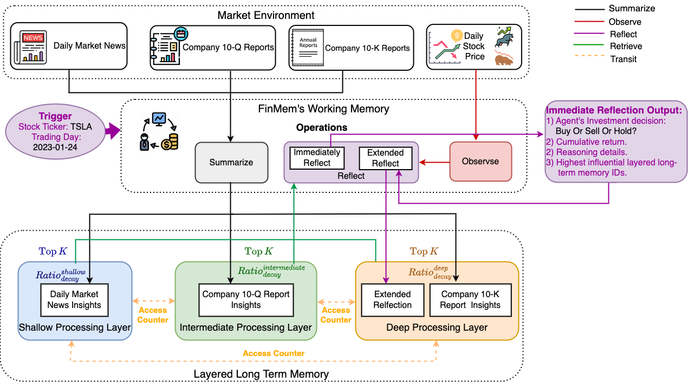
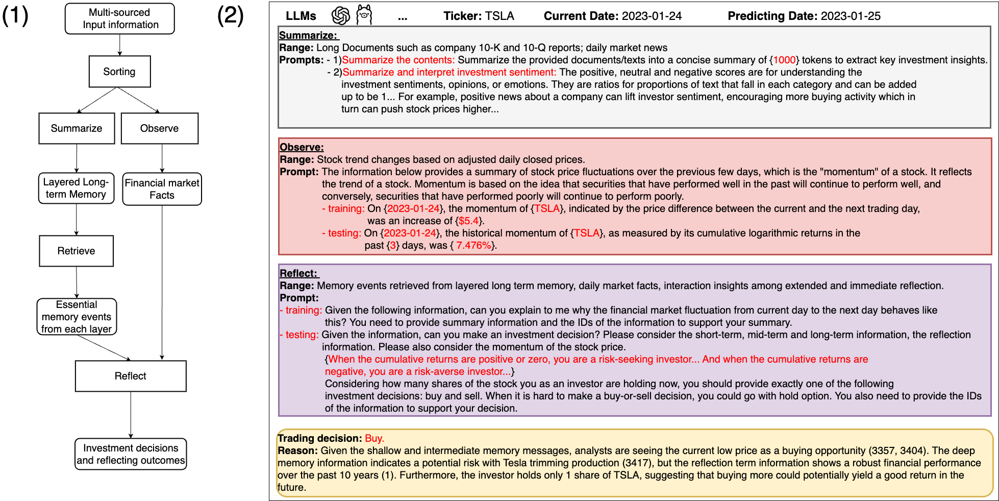
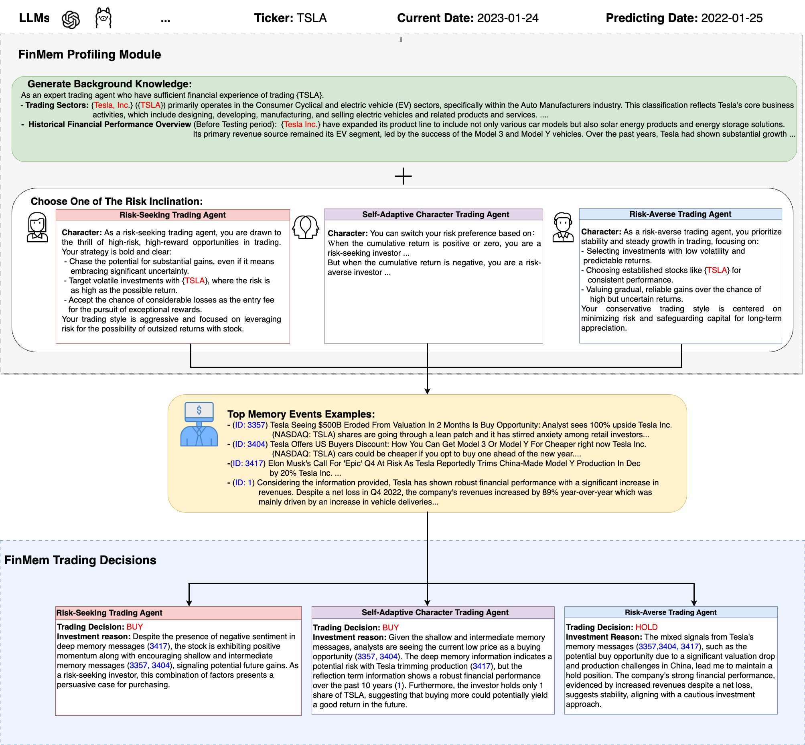

# PredictorLLM: An Advanced LLM-Based Trading Agent for Stocks and Crypto

[](https://www.python.org/downloads/release/python-3100/)
[](https://opensource.org/licenses/MIT)
[](https://github.com/ambv/black)

**PredictorLLM** is an advanced trading agent framework built upon large language models (LLMs) to facilitate automated trading across multiple financial markets—ranging from traditional equities (stocks) to digital assets (cryptocurrencies). This framework integrates a **layered, human-inspired memory system** with intelligent design features, enabling robust decision-making in dynamic markets.

## Overview

PredictorLLM consists of three core modules:

1. **Profiling Module**  
   Establishes agent characteristics, operational scope, and risk preferences (adaptable for both stocks and crypto).

2. **Layered Memory Module**  
   A structured multi-level memory system, which stores and retrieves relevant textual data (e.g., news, filings, protocol updates) to guide the agent’s trading logic.

3. **Decision-Making Module**  
   Translates insights from memory into actionable trading strategies. The agent can handle short-term, mid-term, long-term, and reflection-level analyses, mimicking professional traders yet surpassing human limitations in data processing.

By continuously learning from market fluctuations—whether from stock price changes or on-chain data for crypto—PredictorLLM adapts to volatility and evolving trends, aiming for improved investment outcomes over time.

<div align="center">
  
  <br/><em>Illustration of multi-level memory flow</em>
</div>

<div align="center">
  
  <br/><em>Overall workflow architecture</em>
</div>

<div align="center">
  
  <br/><em>Character design concept for the AI trader</em>
</div>

---

## System Requirements

- **Operating System**: Works on macOS, Linux, and Windows.
- **Python**: Version **3.10** or higher is recommended.
- **Memory**: At least 8 GB RAM if you plan on handling moderate to large datasets.  
  (For CPU-based local runs with large LLMs, you may need significantly more memory or a GPU setup.)
- **GPU** (optional but recommended): For accelerated model inference and training if running on large language model backends locally.
- **Storage**: A few gigabytes for storing datasets and checkpoints (the exact amount depends on your datasets).

---

## Getting Started

### 1. Clone the Repository

```bash
git clone https://github.com/IrvanIpanJP/predictor-llm.git
cd predictor-llm
```

### 2. Install Dependencies

We recommend using **Poetry** for managing dependencies. First, install Poetry if you haven't already:

```bash
pip install poetry
```

Then, install the dependencies:

```bash
poetry install
```

You may also activate the virtual environment:

```bash
poetry shell
```

Alternatively, you can use Docker for a containerized setup:

```bash
docker-compose up --build
```

### 3. Configure Your Agent

- Locate the **`config/config.toml`** file in the repository.
- Update the relevant fields according to your environment. For example:
  - **`market_data_path`** for specifying where your stock/crypto price data is located.
  - **`embedding`** details if you use OpenAI or a local LLM for embeddings.
  - **`short`, `mid`, `long`, `reflection`** memory thresholds and decay parameters.

Make sure you specify paths that match your system layout.

### 4. Running the Agent

To see available commands:

```bash
python run.py --help
```

### 5. Training the Model

To train the agent on your data, use the `train` command:

```bash
python run.py train \
  --market-data-path /path/to/data \
  --start-time 2020-01-01 \
  --end-time 2025-01-01
```

> **Note:** Adjust the date range and data path to match your dataset.  
>  The agent will load configurations from **`config/config.toml`** at runtime.

### 6. Resume Training from a Checkpoint

If your training halted unexpectedly or you wish to continue from a certain point:

```bash
python run.py train-checkpoint
```

---

## Practical Examples

### Example 1: Basic Stock Trading Setup

1. **Data Source**  
   Use Yahoo Finance to fetch daily stock data, storing it as CSV in `./data/stocks`.

2. **Configuration**  
   In **`config/config.toml`**, set:
   ```toml
   market_data_path = "./data/stocks"
   start_date = "2023-01-01"
   end_date = "2023-12-31"
   # ...
   ```
3. **Run the Agent**
   ```bash
   python run.py train --market-data-path ./data/stocks \
     --start-time 2023-01-01 \
     --end-time 2023-12-31
   ```
4. **Outcome**  
   The agent will ingest data, store relevant memory entries (e.g., short-term news, mid-term filings),  
   and generate stock trading signals based on historical trends and the LLM reflection.

### Example 2: Crypto Market Analysis

1. **Data Source**  
   Fetch cryptocurrency data (e.g., from CoinGecko API) and place it in `./data/crypto`.

2. **Configuration**  
   In **`config/config.toml`**, set:
   ```toml
   market_data_path = "./data/crypto"
   start_date = "2023-01-01"
   end_date = "2023-12-31"
   # ...
   ```
3. **Run the Agent**
   ```bash
   python run.py train --market-data-path ./data/crypto \
     --start-time 2023-01-01 \
     --end-time 2023-12-31
   ```
4. **Outcome**  
   The agent will process both price data and on-chain analytics (if configured) and build trading strategies accordingly.

---

## Troubleshooting

1. **Installation Problems**

   - **Poetry or Docker**: Make sure Poetry is installed correctly (`poetry --version`), or verify Docker is running if using containers.
   - **Dependency Conflicts**: If you encounter version conflicts, try using `poetry update` or re-create the environment.

2. **Config File Not Found**

   - Double-check you’re running the command from the project root, so relative paths like `config/config.toml` are accessible.
   - Ensure you have spelled file/directory names correctly.

3. **Out of Memory (OOM) Errors**

   - If you’re running large LLM embeddings on CPU, reduce the batch size or opt for a smaller model.
   - If Docker containers are limited in memory, increase Docker’s resource allocation under preferences.

4. **Checkpoint Loading Issues**

   - Confirm that the checkpoint directory structure (e.g., `checkpoints/brain` or `agent_name/brain`) is intact.
   - Make sure the versions of the code and the checkpoint are compatible.

5. **GPU Inference Not Working**
   - Verify that CUDA or ROCm is installed properly, depending on your GPU hardware.
   - Check that any relevant PyTorch or TensorFlow version supports your GPU.

For additional help, search or create an issue on [GitHub](https://github.com/IrvanIpanJP/predictor-llm/issues).

---

## Multi-Asset Data Handling

PredictorLLM supports **equity** (stock) and **cryptocurrency** data. You can integrate additional data sources such as:

| Type                         | Source                                                | Notes                           | Example Download / API                                                   |
| ---------------------------- | ----------------------------------------------------- | ------------------------------- | ------------------------------------------------------------------------ |
| **Daily Stock Price**        | [Yahoo Finance](https://finance.yahoo.com/)           | Open, High, Low, Close, Volume  | [yfinance](https://pypi.org/project/yfinance/)                           |
| **Daily Market News**        | [Alpaca Market News API](https://alpaca.markets/)     | Historical news                 | [Alpaca Docs](https://docs.alpaca.markets/docs/news-api)                 |
| **Company 10-K / 10-Q**      | [SEC EDGAR](https://www.sec.gov/edgar.shtml)          | e.g., Item 7 / Part 1 Item 2    | [SEC API](https://sec-api.io/docs)                                       |
| **Crypto Price Feeds**       | [CoinGecko API](https://www.coingecko.com/en/api)     | Daily OHLC data, volume, etc.   | [CoinGecko data endpoints](https://www.coingecko.com/en/api)             |
| **On-Chain / Protocol Data** | Etherscan, Polygonscan, or other blockchain explorers | Transaction metrics, DEX volume | Various explorer APIs (e.g., [Etherscan API](https://etherscan.io/apis)) |

---

## Contributing

We welcome contributions to extend crypto-specific features, add new data sources, optimize memory layers, or refine LLM-based decisions. Here’s how you can help:

1. **Fork the Repository**  
   Create your own copy of **PredictorLLM** on GitHub.

2. **Create a Feature Branch**

   ```bash
   git checkout -b feature/my-awesome-improvement
   ```

3. **Code & Document**

   - Follow [PEP8](https://peps.python.org/pep-0008/) or run `black` for consistent formatting.
   - Write or update docstrings and tests for new functionality.

4. **Submit a Pull Request**  
   Provide a clear description of your changes, rationale, and any relevant issues. If accepted, your PR will be merged into the main branch.

For more guidelines, please see [CONTRIBUTING.md](CONTRIBUTING.md) (coming soon).

---

## License

This project is licensed under the [MIT License](LICENSE).

---

**Happy Trading!**

Leverage the power of LLMs for **stocks**, **crypto**, and more—adapt and integrate data sources, and enjoy a flexible, human-like memory system for advanced automated trading.
